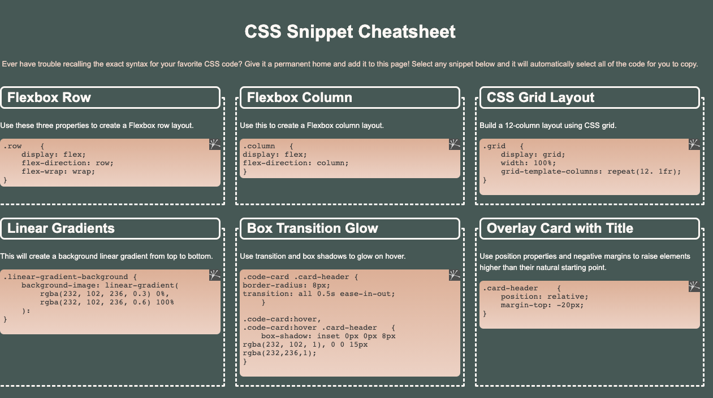

# Mini Project #2: CSS Cheat Sheet

## Description
This HTML project compiles my most used CSS code snippets in a single location. The site has single-click copying functionality for easy use.

## Acceptance Criteria
```md
* Must use semantic HTML elements and proper indentation.

* Use CSS variables to maintain clean and reusable values for a color scheme.

* Use flexbox and media queries to create a responsive grid layout.

* Each CSS snippet should have a card-like layout with the CSS syntax wrapped in an [HTML pre element](https://developer.mozilla.org/en-US/docs/Web/HTML/Element/pre).

* Each CSS snippet can easily be highlighted for copying on click using the [CSS user-select property](https://developer.mozilla.org/en-US/docs/Web/CSS/user-select).

* Must incorporate a background color using a [CSS linear-gradient function](https://developer.mozilla.org/en-US/docs/Web/CSS/linear-gradient).

* Must incorporate a bit of animation using the [CSS transition property](https://developer.mozilla.org/en-US/docs/Web/CSS/transition).

* You can decide which CSS styles and colors you will use to design the application, but the app needs to be a responsive.
```

## Technologies Used
* HTML, CSS

## Screenshot


## Repository
* GitHub Repo: https://github.com/bleufox/Mini_Project2

## Creator
Ashley Jones, Full Stack Developer Student
* Email: thebleufox8@gmail.com
* GitHub: https://github.com/bleufox